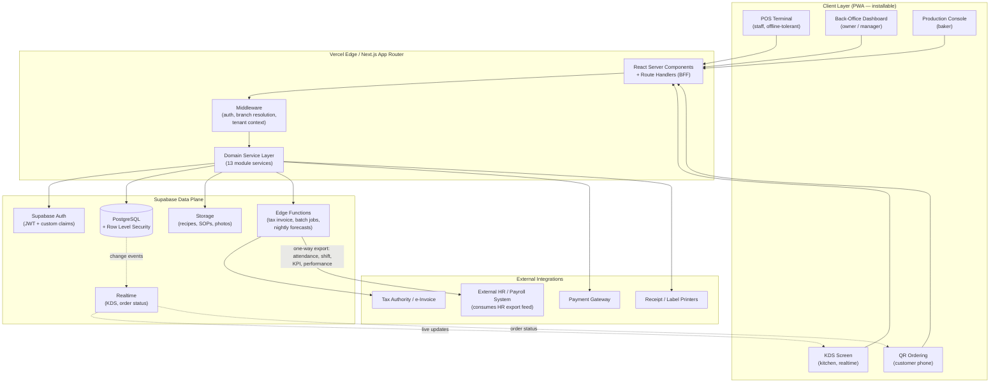
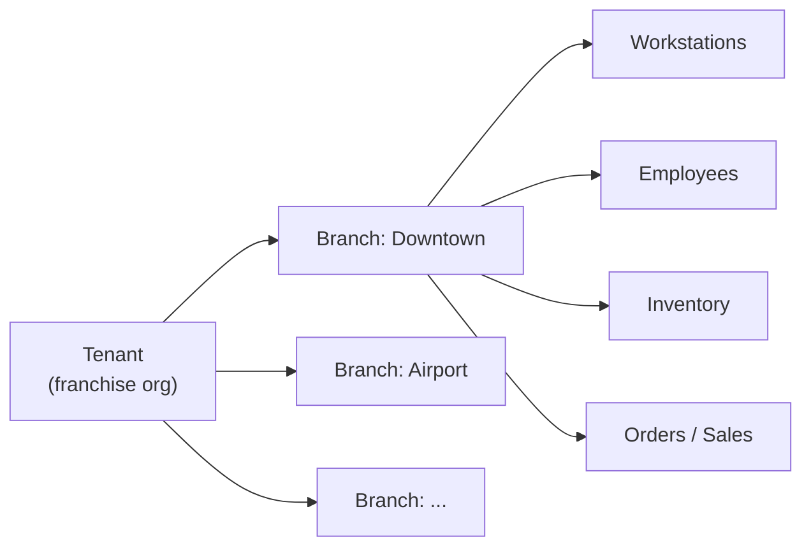
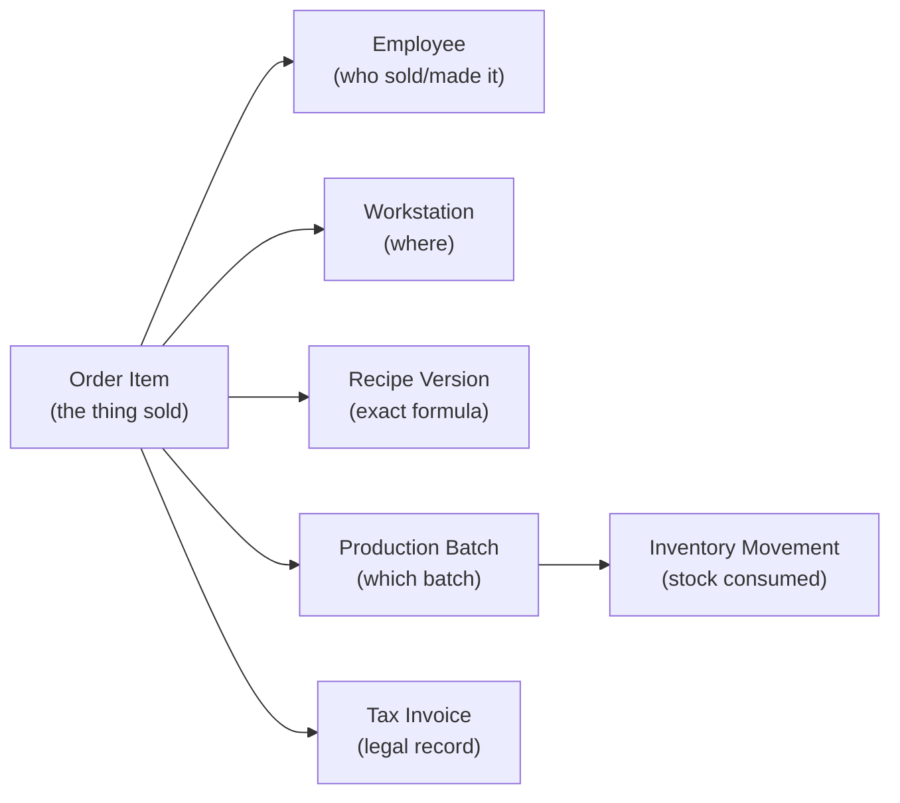

# 01 — System Architecture

> Part of the [MR.BANANA'S OS architecture set](./00-README.md). Status: **Draft for approval.**

---

## 1. Architectural style

A **modular monolith on a serverless edge**, not microservices.

- **Why a monolith:** A single-store-first business does not need the operational
  overhead of distributed services. One Next.js application, one Postgres database,
  with strict internal module boundaries (see [Module Dependency Map](./07-module-dependency-map.md)).
- **Why "ready to split":** Modules communicate through well-defined service
  interfaces and an event log, so any high-load module (e.g. KDS realtime, QR
  ordering) can later be extracted to its own Edge Function or service without
  reworking the data model.
- **Why serverless:** Vercel + Supabase removes server management entirely, which
  suits a business operator, not a platform team. Cost scales with branches.

---

## 2. High-level system diagram

---

## 3. Layered responsibilities

| Layer | Responsibility | Must NOT do |
|-------|----------------|-------------|
| **Client (PWA)** | Render UI, capture input, cache for offline, optimistic updates | Hold business rules or trust its own state for authorization |
| **Middleware** | Resolve session → tenant + branch + role; inject context; reject unauthenticated | Contain domain logic |
| **Route Handlers (BFF)** | Validate input (zod), orchestrate service calls, shape responses | Talk to DB directly with raw SQL |
| **Domain Service Layer** | Enforce business invariants (traceability, FEFO, shelf life), transactions | Bypass RLS using service-role key for user-facing reads |
| **PostgreSQL + RLS** | Persist data, enforce access at row level, run integrity constraints | Trust the app to have filtered correctly |
| **Edge Functions** | Long/async jobs: invoice generation, production scheduling, KPI rollups | Be on the synchronous request path of POS |

**Golden rule:** the **database** is the final authority on access. The service
layer uses the *user's* JWT for all user-facing operations so RLS applies; the
elevated **service role key** is used only inside trusted server jobs (Edge
Functions, cron), never proxied from the browser.

---

## 4. Multi-tenancy & branch model

- **Single shared database**, isolated by `tenant_id` + `branch_id` columns on every
  business table — enforced by RLS, not by the app.
- A user's JWT carries `tenant_id` and a set of `branch_ids` they may access plus
  their `role` per branch.
- **Single-store today:** one tenant, one branch. **Franchise tomorrow:** add rows.
  No schema change, no migration. This is the single most important scaling decision.

See the [Security Model](./05-security-model.md) for exactly how RLS enforces this.

---

## 5. The traceability spine

Every sold item carries an unbroken provenance chain. This is realized as foreign
keys threaded through the data model so a single `order_item` resolves to all six
anchors:

- **Made-to-order beverages:** the chain is created *at sale time* — recipe version
  + workstation + employee captured on the order item; ingredients decremented as an
  inventory movement.
- **Batch-produced bakery:** the chain is created *during production* — the batch
  records recipe version, baker, workstation, and consumes raw/semi-finished
  inventory; at sale the order item links to the finished batch.

This dual path is why **Production Batch** sits at the center of the model.

---

## 6. Real-time strategy

| Surface | Mechanism | Fallback |
|---------|-----------|----------|
| KDS order tickets | Supabase Realtime (Postgres change feed) | Poll every 5s |
| QR order status to customer | Realtime channel per order | Poll on pull-to-refresh |
| Back-office dashboards | Server Components + on-demand revalidation | Manual refresh |
| Production timers (proof/ferment) | Client timers anchored to DB timestamps | Recompute from server time |

---

## 7. Offline tolerance (POS & KDS)

The POS is the most failure-sensitive surface — it must take money during a network
outage.

- **Service Worker** caches the app shell + active menu + open orders.
- Sales taken offline are written to an **outbox queue** (IndexedDB) with a
  client-generated UUID.
- On reconnect, the queue replays through the service layer; the server is the
  source of truth and resolves conflicts (e.g. stock now depleted) by flagging, not
  silently dropping.
- **Tax invoices are never finalized offline** — they are issued only once the sale
  is confirmed server-side, preventing duplicate/invalid legal records.

---

## 8. Key cross-cutting concerns

| Concern | Approach |
|---------|----------|
| **Audit logging** | Append-only `audit_log` table written by DB triggers on every mutation to sensitive tables; never editable from the app. |
| **Idempotency** | Client UUIDs on orders/payments; unique constraints prevent double-charge on retry. |
| **Money & tax** | Integer minor units (no floats); tax computed server-side; invoices immutable. |
| **Time** | All timestamps `timestamptz` in UTC; display localized per branch. |
| **Shelf life** | DB-level expiry computed from batch + recipe shelf-life; FEFO enforced in inventory service. |
| **Observability** | Structured logs, Supabase logs, Vercel analytics; KPI rollups via scheduled Edge Functions. |

---

## 9. Environments

| Env | Frontend | Data | Purpose |
|-----|----------|------|---------|
| Local | Next.js dev | Supabase local (Docker) | Development |
| Preview | Vercel preview per PR | Supabase branch DB | Review |
| Staging | Vercel staging | Staging project | Pre-release, seed data |
| Production | Vercel prod | Supabase prod | Live store(s) |

Database schema is managed as **versioned SQL migrations** committed to the repo —
never hand-edited in the dashboard.

---

## 10. Architecturally significant decisions (summary)

| # | Decision | Rationale |
|---|----------|-----------|
| AD-1 | Modular monolith, not microservices | Matches single-store reality; clean boundaries allow later split |
| AD-2 | `tenant_id` + `branch_id` on all tables from day one | Franchise scaling without migration |
| AD-3 | RLS as primary authorization | DB is the final authority; app cannot leak across branches |
| AD-4 | Append-only ledgers for inventory/production/audit/invoices | Traceability & compliance demand immutability |
| AD-5 | Production Batch as the central traceability hub | Bridges made-to-order and batch-produced paths |
| AD-6 | PWA with offline outbox for POS | Sales must survive network outages |
| AD-7 | Integer minor units for money | Eliminates floating-point money bugs |

> Each decision should graduate into a formal ADR (`/docs/adr/`) during build.
