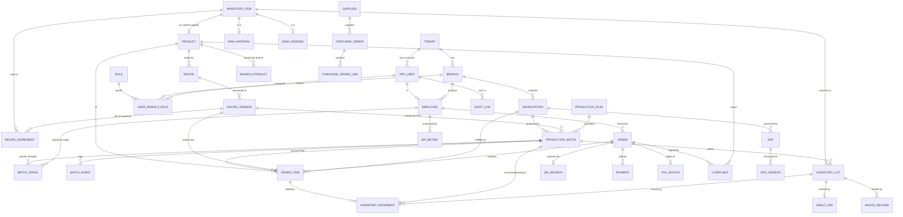
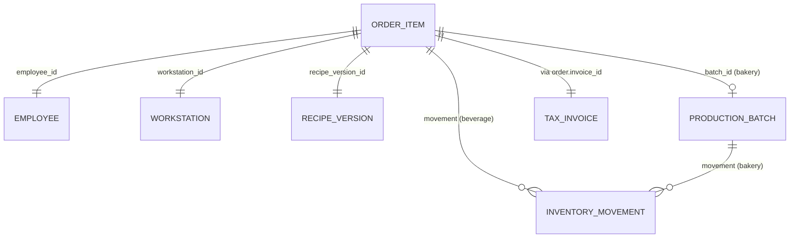

# 02 — Database ER Diagram

> Part of the [MR.BANANA'S OS architecture set](./00-README.md). Status: **Draft for approval.**

This is the **logical** data model. It is normalized for integrity and built around
the traceability spine. Column lists are representative, not exhaustive — every
business table additionally carries `tenant_id`, `branch_id`, `created_at`,
`updated_at`, and (where mutable) `created_by`.

---

## 1. Domain groupings

The model divides into seven domains:

1. **Tenancy & Identity (+ HR & Labor)** — tenants, branches, users, employees, roles, workstations; shifts, assignments, time entries, HR exports
2. **Catalog & Recipes** — products, branch overrides, recipes, recipe versions, ingredients (BoM)
3. **Sales** — orders, order items, payments, QR sessions
4. **Production** — production plans, batches, batch stages, batch events
5. **Inventory & Purchasing** — `inventory_item` supertype, raw/semi/finished, unit conversions, lots, movements, suppliers, POs, customers
6. **Compliance & Quality** — tax invoices (+ number-gap log), shelf-life, waste, SOPs, complaints, **recall & quarantine**
7. **Audit & Performance** — audit log, KPI metrics

---

## 2. Master ER diagram

> Mermaid is kept to the core relationships for legibility. The two link tables below
> complete the traceability chain.

---

## 3. The traceability resolution

Given one `ORDER_ITEM`, the system resolves the full provenance:

- **Beverage (made-to-order):** `batch_id` is null; ingredient depletion is recorded
  as `INVENTORY_MOVEMENT` rows referencing the order item.
- **Bakery (batch-produced):** `batch_id` is set; depletion was recorded against the
  batch during production, and the finished lot is decremented at sale.

Either way, all six anchors (employee, workstation, recipe version, batch, inventory
movement, tax invoice) are reachable from the order item.

---

## 4. Table reference (key columns)

### Tenancy & Identity

| Table | Key columns | Notes |
|-------|-------------|-------|
| `tenant` | id, name, status | The franchise org. One row today. |
| `branch` | id, tenant_id, name, address, tax_profile_id, timezone | A physical store. |
| `app_user` | id (= Supabase auth uid), tenant_id, email, status | Mirrors Supabase Auth. |
| `employee` | id, tenant_id, branch_id, user_id?, code, name, hire_date | Not every employee is a login user; not every user is staff. |
| `role` | id, key, name | owner, manager, staff, baker, customer. |
| `user_branch_role` | user_id, branch_id, role_id | **Many-to-many**: a user can hold different roles in different branches. |
| `workstation` | id, branch_id, name, type (`beverage`/`bakery_oven`/`prep`/`pos`) | Physical station; anchors traceability. |

### HR & Labor

Added per the locked HR scope ([Considerations §10](./09-design-considerations.md)).
MR.BANANA'S OS is the **system of record** for these; **payroll calculation is
external** and consumes the `hr_export` feed.

| Table | Key columns | Notes |
|-------|-------------|-------|
| `shift` | id, branch_id, role_hint, planned_start, planned_end, status | A scheduled work block. |
| `shift_assignment` | id, shift_id, employee_id, status | Who is rostered to a shift. |
| `time_entry` | id, employee_id, branch_id, shift_id?, clock_in, clock_out, source (`pos`/`kiosk`/`manual`), approved_by? | **Append-only** actual clock-in/out; corrections are approved adjustments. |
| `hr_export` | id, tenant_id, branch_id?, export_type (`attendance`/`shift`/`kpi`/`performance`), period_start, period_end, format, status, payload_ref, generated_by, generated_at | **Audit record of every outbound export** to the external HR/payroll system. No salary/pay data stored. |

### Catalog & Recipes

| Table | Key columns | Notes |
|-------|-------------|-------|
| `product` | id, tenant_id, inventory_item_id? (set for batch/finished goods), sku, name, category (`beverage`/`bakery`), type (`made_to_order`/`batch`), is_active | The sellable thing. Batch products own an `inventory_item` (they're stocked); made-to-order beverages are assembled at sale and not stocked as finished goods. |
| `branch_product` | id, branch_id, product_id, price_override?, is_available, menu_section | **Per-branch price / availability / menu (F2).** Single-store ignores it; franchises override here. Orders/invoices still snapshot the *effective* price, so history stays correct. |
| `recipe` | id, product_id, name | A product may have one active recipe. |
| `recipe_version` | id, recipe_id, version_no, status (`draft`/`active`/`retired`), shelf_life_hours, yield_qty, effective_from | **Immutable once active.** Edits create a new version. |
| `recipe_ingredient` | id, recipe_version_id, **item_id (→ `inventory_item`)**, quantity, unit | Bill of materials. A **single FK** to the supertype (N1) replaces the old nullable raw/semi exclusive-arc. |

### Sales

| Table | Key columns | Notes |
|-------|-------------|-------|
| `qr_session` | id, branch_id, workstation_id?, table_label, token, status, opened_at | A customer scan opens a session. |
| `order` | id, branch_id, employee_id, qr_session_id?, channel (`pos`/`qr`), status, subtotal, tax_total, total, invoice_id? | Money in integer minor units. |
| `order_item` | id, order_id, product_id, recipe_version_id, workstation_id, employee_id, batch_id?, qty, unit_price, line_tax, status (`queued`/`making`/`ready`/`served`) | **The traceability anchor.** |
| `payment` | id, order_id, method, amount, status, gateway_ref, client_uuid | Idempotent via client_uuid. **Hosted/tokenized gateway (#6)** — only a `gateway_ref` token is stored, never card data (keeps us out of PCI scope). |

### Production

| Table | Key columns | Notes |
|-------|-------------|-------|
| `production_plan` | id, branch_id, plan_date, status, created_by | Daily/weekly schedule. |
| `production_batch` | id, branch_id, plan_id?, recipe_version_id, workstation_id, **lead_employee_id?** (optional owner only), batch_code, planned_qty, **actual_yield** (drives finished-lot qty — B2), status (`planned`/`in_progress`/`completed`/**`failed`**/**`scrapped`**/**`quarantined`**), started_at, completed_at | **Central hub.** Multi-day via stages. Failure/partial-yield paths now first-class (B2). |
| `batch_stage` | id, batch_id, stage (`mix`/`ferment`/`proof`/`bake`/`cool`/`pack`), seq, **employee_id?** (who performed *this* stage — B1), planned_start, planned_end, actual_start, actual_end, status | Models multi-day processes. **Provenance is per-stage** — a multi-day batch spanning shifts/bakers attributes each stage to its actual worker. |
| `batch_event` | id, batch_id, stage_id?, employee_id, event_type, payload, occurred_at | Append-only production log (temperature, checks, notes). |

### Inventory

> **Supertype (N1):** `inventory_item` is the single referenceable identity for anything
> stockable. `raw_material`, `semi_finished`, and (for batch goods) `product` each own a
> 1:1 row in it via shared primary key. Lots, movements, waste and recipe ingredients carry
> **one real FK** `item_id → inventory_item.id` — no polymorphic `(kind,id)` columns, full
> referential integrity.

| Table | Key columns | Notes |
|-------|-------------|-------|
| `inventory_item` | id, tenant_id, item_kind (`raw`/`semi`/`finished`), base_unit | **Supertype.** One row per stockable thing; the single FK target. |
| `raw_material` | id (= `inventory_item.id`), sku, name, reorder_point | Ingredients/supplies. |
| `semi_finished` | id (= `inventory_item.id`), sku, name | WIP (dough, starter). |
| `unit_conversion` | id, tenant_id, item_id? (null = global), from_unit, to_unit, factor | **UoM model (#2):** convert e.g. kg↔g, L↔ml; recipe grams vs lot kilograms reconcile here. |
| `inventory_lot` | id, branch_id, **item_id (→ `inventory_item`)**, batch_id?, qty_on_hand (**cache**), unit, received_at, **expires_at (single source — N2)**, status (`available`/`quarantined`/`expired`/`depleted`) | A trackable lot. Expiry lives **only** here. `qty_on_hand` is a transactionally-maintained **cache**, never the authority (N3). |
| `inventory_movement` | id, branch_id, lot_id, **item_id**, qty_delta, reason (`receive`/`consume`/`produce`/`sell`/`waste`/`adjust`/`transfer`), ref_type, ref_id, employee_id, occurred_at | **Append-only ledger — the authority** (N3). A scheduled job reconciles `qty_on_hand` from this and alarms on drift. |

### Purchasing & Customers (minimal)

Added per scope decisions #4 (minimal suppliers) and #3 (anonymous-first customers).

| Table | Key columns | Notes |
|-------|-------------|-------|
| `supplier` | id, tenant_id, name, contact, status | **Minimal supplier master (#4).** |
| `purchase_order` | id, branch_id, supplier_id, status, ordered_at, expected_at | Minimal PO header. |
| `purchase_order_line` | id, po_id, item_id (→ `inventory_item`), qty, unit, unit_cost | Receiving a line posts a `receive` movement + new `inventory_lot`. |
| `customer` *(optional)* | id, tenant_id, contact, created_at | **Anonymous-first (#3):** QR/POS customers are anonymous by default; this row exists only if a customer opts into a light profile. No PII required to order. |

### Compliance & Quality

| Table | Key columns | Notes |
|-------|-------------|-------|
| `tax_invoice` | id, branch_id, order_id, invoice_no (**sequential per branch**), sale_occurred_at, tax_profile, vat_rate (default `0.07` — Thailand), subtotal, vat_amount, total, issued_at, status | **Immutable.** Thailand VAT 7%. `sale_occurred_at` = the tax point (set at sale, even if issued later after offline sync). Corrections issue credit notes (separate sequential series, same documented-gap policy). |
| `invoice_number_gap` | id, branch_id, missing_no, series (`invoice`/`credit_note`), reason (`cancelled_before_issue`/`system_failure`/`rollback`), context, recorded_by, recorded_at | **Append-only.** Documents every skipped number. Sequencing is sequential-by-branch with *documented gaps* — strict gapless is explicitly **not** attempted (see [Review T1/T4](./10-architecture-review.md)). |
| `shelf_life` *(view, not a table — N2)* | derived: lot_id, produced_at, expires_at, days_remaining, status (`fresh`/`expiring`/`expired`) | **A view over `inventory_lot`.** Expiry is computed from recipe `shelf_life_hours` at lot creation and stored once on the lot; FEFO = `ORDER BY expires_at`. No stored `fefo_rank` to go stale. |
| `waste_record` | id, branch_id, lot_id?, **item_id (→ `inventory_item`)**, qty, reason (`spoilage`/`expiry`/`production_loss`/`damage`), cost_value, employee_id, occurred_at | Single-FK item reference (N1). Feeds cost & KPI; scrapped batch inputs/outputs land here (B2). |
| `sop` | id, tenant_id, branch_id?, workstation_id?, title, category | Standard operating procedure. |
| `sop_version` | id, sop_id, version_no, content_ref (Storage), status, effective_from | Versioned documents/media. |
| `complaint` | id, branch_id, order_id?, product_id?, customer_contact, channel, severity, status (`open`/`investigating`/`resolved`/`closed`), assigned_to, resolution, recall_id? | Workflow-tracked. A complaint may escalate into a recall. |

### Recall & Quarantine

Required at launch ([C1 decision](./09-design-considerations.md)). Built directly on the
traceability spine: from a quarantined batch the system fans out to every affected lot,
product and order. **Recall history is immutable** — the recall record and its action log
are append-only.

| Table | Key columns | Notes |
|-------|-------------|-------|
| `recall` | id, tenant_id, branch_id, scope_type (`batch`/`lot`), scope_ref_id, reason, severity, status (`initiated`/`investigating`/`completed`/`closed`), initiated_by, initiated_at | The recall event. **Append-only** — status advances via `recall_action`; the row is never deleted. |
| `recall_action` | id, recall_id, action_type (`quarantine`/`identify`/`notify`/`dispose`/`close`), actor_user_id, payload, occurred_at | **Append-only, immutable** audit trail of every recall step. |
| `recall_affected` | id, recall_id, entity_type (`product`/`inventory_lot`/`order`/`order_item`), entity_id, captured_at | **Immutable snapshot** of what the recall touched, computed at initiation by traversing the spine (batch → lots → order_items → orders). |

**Status additions for quarantine enforcement:**
- `production_batch.status` gains **`quarantined`**.
- `inventory_lot.status` gains **`quarantined`**.
- A quarantined batch/lot **cannot be sold** — enforced as a service invariant *and* a
  DB-level guard (the sale transaction rejects any `order_item` sourced from a
  `quarantined` lot/batch).

### Audit & Performance

| Table | Key columns | Notes |
|-------|-------------|-------|
| `audit_log` | id, tenant_id, branch_id, actor_user_id, action, entity_type, entity_id, before, after, occurred_at | **Append-only**, written by DB triggers. Never editable. |
| `kpi_metric` | id, branch_id, employee_id?, metric_key, period, value, computed_at | Rolled up by scheduled jobs (orders/hr, waste %, complaint rate, on-time production). |

---

## 5. Integrity rules enforced in the database

| Rule | Mechanism |
|------|-----------|
| Active recipe versions are immutable | Trigger blocks UPDATE when `status='active'`; changes require new version |
| All stockable items referenced by one enforceable FK | `inventory_item` supertype; lots/movements/waste/ingredients FK to it (N1) — no polymorphic columns |
| Expiry has a single source of truth | `expires_at` only on `inventory_lot`; `shelf_life` is a view; FEFO = `ORDER BY expires_at` (N2) |
| On-hand reconciles to the ledger | `inventory_movement` is authority; `qty_on_hand` is a transactional cache + nightly reconciliation that alarms on drift (N3) |
| No oversell under concurrency | Sale decrements the lot via `SELECT … FOR UPDATE` / atomic `UPDATE … WHERE qty_on_hand >= n` inside the sale txn (I1) |
| Per-stage production provenance | `batch_stage.employee_id` records who did each stage; whole-batch single-baker attribution removed (B1) |
| Batch failure & partial yield | `production_batch.status` includes `failed`/`scrapped`; `actual_yield` drives output; scrap → `waste_record` (B2) |
| Inventory never goes negative without an adjustment | Enforced by I1 atomic decrement; corrections post an `adjust` movement |
| Tax invoice numbers are sequential per branch, gaps documented | Per-branch counter + unique `(branch_id, invoice_no)`, insert-only; any skipped number is recorded in `invoice_number_gap` (Thailand VAT, documented-gap policy) |
| Quarantined stock cannot be sold | Sale transaction rejects `order_item` whose lot/batch `status='quarantined'` (service invariant + DB guard) |
| Recall history is immutable | `recall`/`recall_action`/`recall_affected` are append-only; no UPDATE/DELETE policy |
| An order cannot be invoiced twice | Unique on `order.invoice_id` |
| Payment idempotency | Unique `(order_id, client_uuid)` |
| FEFO | `ORDER BY expires_at` over `inventory_lot` (indexed); service consumes soonest-expiring first — no stored rank (N2) |
| Cross-branch leakage | RLS policies on `tenant_id`/`branch_id` (see [Security Model](./05-security-model.md)) |
| Audit completeness | Triggers on all sensitive tables; no app write path bypasses them |

---

## 6. Indexing strategy (initial)

- Composite `(tenant_id, branch_id)` on every business table — the RLS + query hot path.
- `order_item (batch_id)`, `inventory_movement (lot_id, occurred_at)`,
  `inventory_movement (ref_type, ref_id)` — traceability lookups.
- `inventory_lot (branch_id, item_id, expires_at) WHERE status = 'available'` — FEFO scans (replaces the old stored `fefo_rank` index, N2).
- `tax_invoice (branch_id, invoice_no)` unique — compliance; `invoice_number_gap (branch_id, series, missing_no)` — gap audit.
- `recall_affected (recall_id, entity_type)` and reverse `(entity_type, entity_id)` — fast "is this lot/order under recall?" checks at sale time.
- Realtime tables (`order_item`, `batch_stage`) tuned for change-feed throughput.

---

## 7. Data-model decisions (resolved)

1. ✅ **Units of measure** — `unit_conversion` table (base unit per item + conversions).
2. ✅ **Suppliers & purchasing** — minimal `supplier` + `purchase_order` + `_line` added.
3. ✅ **Customer accounts** — **anonymous-first**; optional light `customer` profile, no
   PII required to order.
4. 🟡 **Modifiers/options** for beverages (size, milk, sugar) — still open; recommend
   `product_modifier` + `order_item_modifier` (affects recipe scaling). Low risk to add in
   Phase 1; not blocking.

> All schema-blocking questions are resolved. Only the (non-blocking) beverage-modifier
> shape remains, slated for Phase 1.
