# 04 — User Flows

> Part of the [MR.BANANA'S OS architecture set](./00-README.md). Status: **Draft for approval.**

Flows for the five roles — **Owner, Manager, Staff, Baker, Customer** — plus the two
defining end-to-end journeys (made-to-order beverage, batch-produced bakery) that
exercise the traceability spine.

---

## 1. Authentication & branch context

Every authenticated session resolves a **tenant → branch → role** context before any
screen renders.

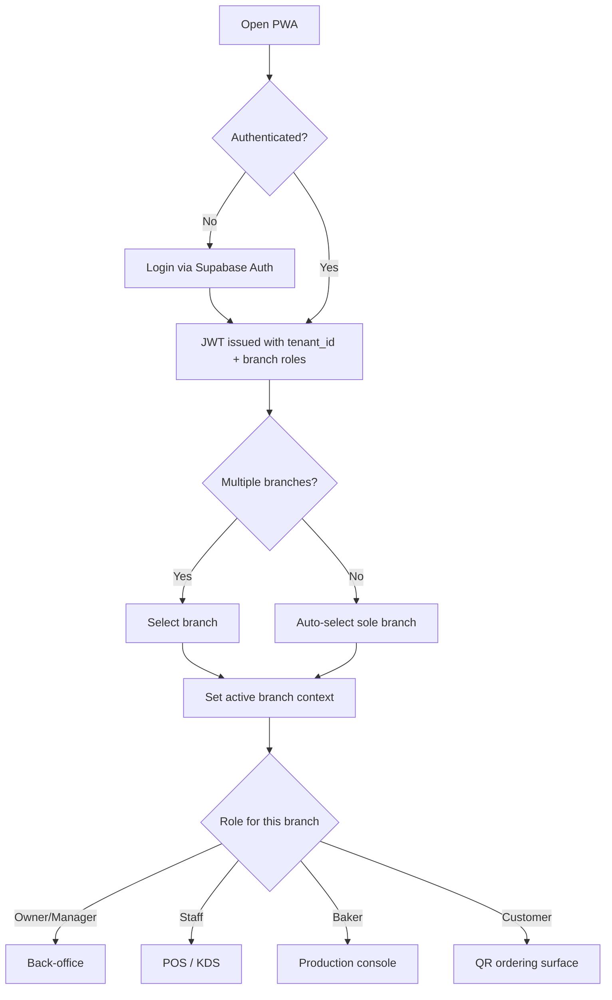

Customers typically arrive **without login** via a QR link; an optional light account
enables order history/loyalty (see open question in the [ER doc](./02-database-er-diagram.md)).

---

## 2. Journey A — Made-to-order beverage (POS + QR + KDS)

This is the high-frequency path. It creates the traceability chain **at sale time**.

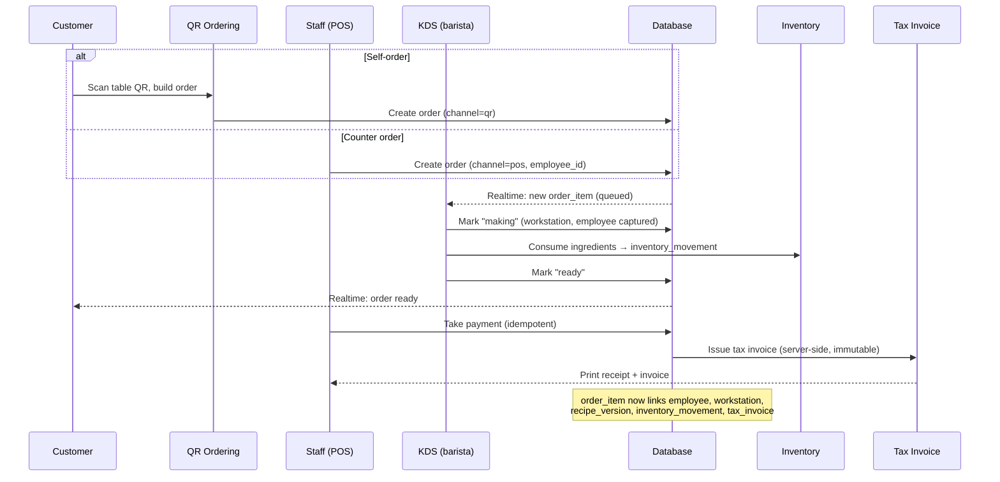

**Traceability captured:** employee, workstation, recipe version, inventory movement,
tax invoice. (`batch_id` is null for made-to-order.)

---

## 3. Journey B — Batch-produced bakery (multi-day)

The chain is created **during production**, days before the sale. This is why
production batches are the central hub.

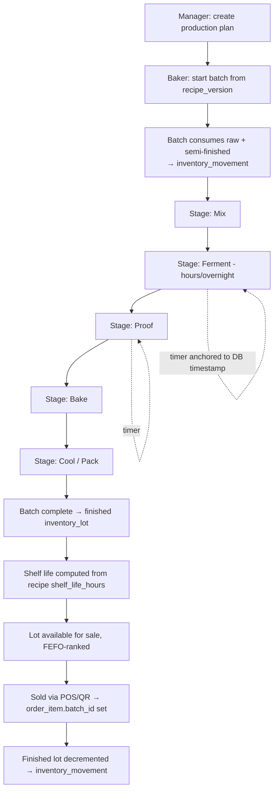

**Multi-day handling:** each `batch_stage` carries planned/actual start+end; long
stages (overnight ferment) are tracked by server-anchored timers so a closed browser
or shift change never loses the clock. Each stage transition writes an append-only
`batch_event`.

**Traceability captured:** baker (employee), workstation, recipe version, production
batch, inventory movements (consume + produce + sell), and tax invoice at sale.

---

## 4. Role flows

### 4.1 Owner

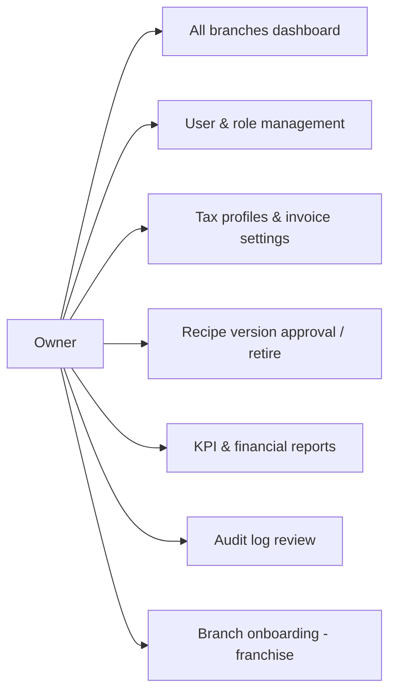

The Owner is the only role with cross-branch visibility and configuration authority,
including franchise branch onboarding.

### 4.2 Manager

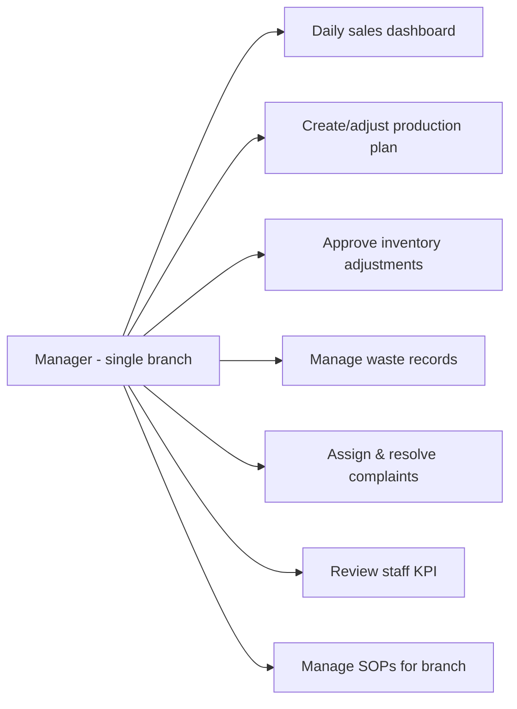

### 4.3 Staff (front-of-house)

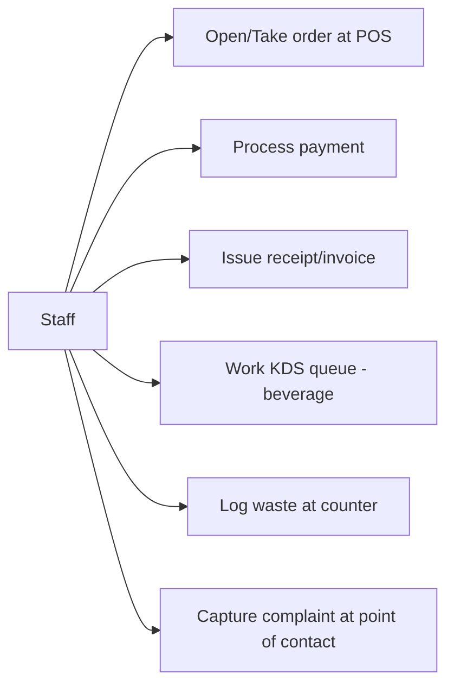

### 4.4 Baker (back-of-house)

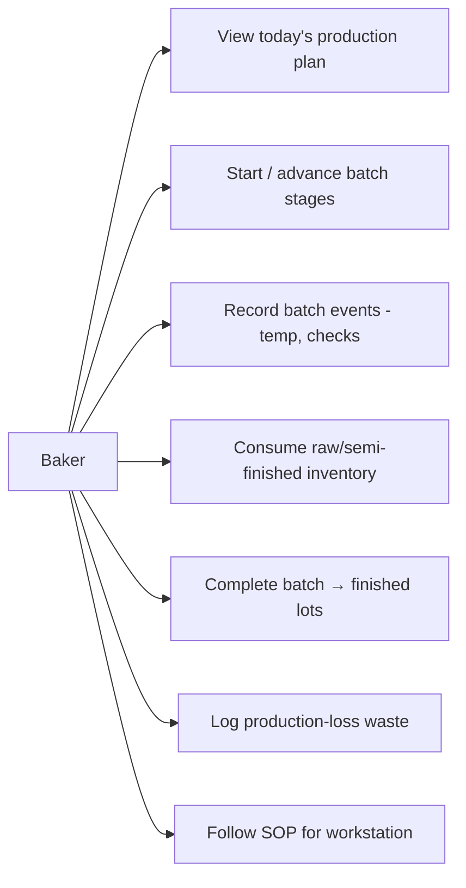

### 4.5 Customer

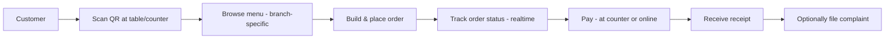

---

## 5. Cross-cutting workflow — Complaint resolution

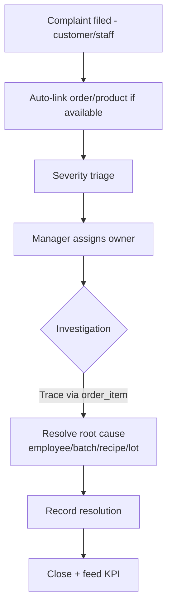

Because every order item is fully traceable, a complaint can be resolved to the exact
batch, recipe version, employee, and workstation involved — turning complaints into
quality signals rather than dead-ends.

---

## 5b. Recall & Quarantine flow (Owner / Manager — required at launch)

Triggered by a quality/safety issue (often escalated from a complaint). Leverages the
traceability spine to find everything the bad batch touched, then quarantines remaining
stock so it cannot be sold.

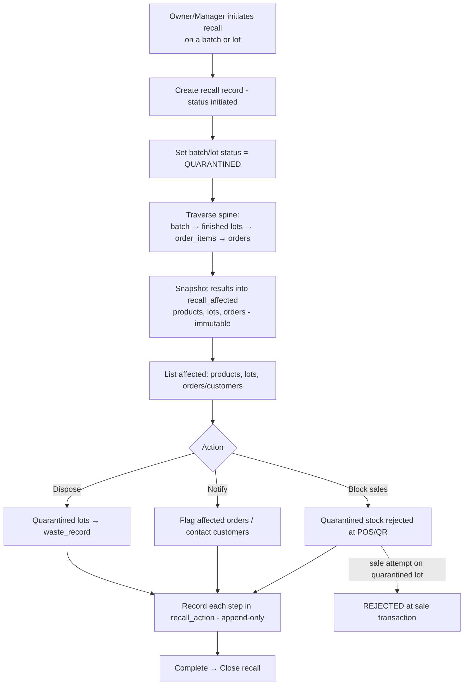

**Guarantees:** every action writes an immutable `recall_action` row; the affected-set is
snapshotted at initiation; a quarantined batch/lot is structurally unsellable; only Owner
and Manager can initiate; all of it is audited.

---

## 6. Offline POS flow (degraded mode)

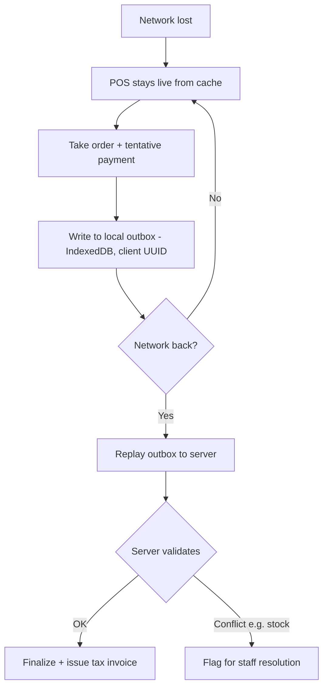

Tax invoices are **never** finalized offline — only after server confirmation — to
keep the legal record's per-branch numbering valid (any genuine gap is documented in
`invoice_number_gap`, not hidden).
