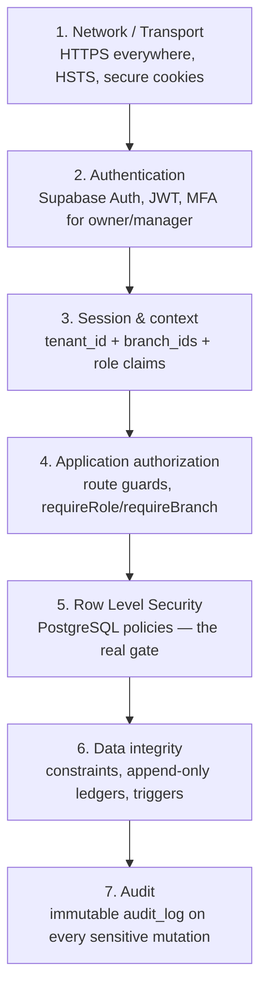

# 05 — Security Model

> Part of the [MR.BANANA'S OS architecture set](./00-README.md). Status: **Draft for approval.**

Security is **mandatory and layered**. The non-negotiable principle: the
**database** is the final authority on access via Row Level Security. The application
is a convenience layer and is never trusted to be the only gatekeeper.

---

## 1. Defense in depth



Each layer assumes the one above it may be bypassed. Even a fully compromised
application server using a user JWT **cannot** read another branch's data, because
RLS evaluates against the JWT claims at the database.

---

## 2. Authentication

| Aspect | Decision |
|--------|----------|
| Provider | Supabase Auth (email/password; optional OAuth later) |
| Tokens | **Short access-token TTL (≤ 5–15 min)** + refresh token with rotation |
| **Revocation (S1)** | A server-side `session_version` (per user) is checked on each request; role change / termination **bumps the version and revokes refresh tokens**, so a stale JWT fails fast instead of lingering until expiry |
| MFA | **Required** for Owner **and** Manager (#5); optional for Staff/Baker |
| Customer | Mostly anonymous (QR); optional light account for history |
| Session storage | HttpOnly, Secure, SameSite cookies — no JWT in localStorage |
| Password policy | Supabase policy + breach check; lockout on repeated failure |
| Service accounts | Service-role key stored only in server env; never shipped to client |

### Custom JWT claims

On login, the user's branch roles are stamped into the JWT (via Supabase Auth hook):

```
{
  "sub": "<user uuid>",
  "tenant_id": "<tenant uuid>",
  "branch_roles": [
    { "branch_id": "<uuid>", "role": "manager" },
    { "branch_id": "<uuid>", "role": "staff" }
  ]
}
```

These claims are what RLS policies read. The claim set is derived server-side from
`user_branch_role` — the client cannot forge it because the JWT is signed.

---

## 3. Authorization — the two gates

### Gate 1: Application (fast feedback, not trusted)

- Route group layouts call `requireRole()` / `requireBranch()` to redirect/hide UI.
- Route handlers validate input with zod and check role before doing work.
- Purpose: good UX (don't show buttons a user can't use), reduced load — **not**
  security of record.

### Gate 2: Row Level Security (the real boundary)

Every business table has RLS **enabled** with policies keyed on tenant + branch +
role. Conceptual policy (illustrative, not final SQL):

```
-- Read: a user may read rows for branches present in their JWT claims
USING (
  tenant_id = auth.tenant_id()
  AND branch_id = ANY (auth.branch_ids())
)

-- Write: additionally requires sufficient role for that branch
WITH CHECK (
  tenant_id = auth.tenant_id()
  AND auth.has_branch_role(branch_id, required_roles => ARRAY['owner','manager'])
)
```

- Helper functions (`auth.tenant_id()`, `auth.branch_ids()`, `auth.has_branch_role()`)
  read the validated JWT claims.
- Policies are **deny-by-default**: no policy → no access.
- All policies live in a single reviewable migration (`0007_rls_policies.sql`).
- **CI guard (S2):** the build **fails** if any table in a business schema lacks
  `ROW LEVEL SECURITY` enabled with ≥ 1 policy. This makes "forgot to add RLS to a new
  table" a red pipeline, not a silent open door — the cheapest high-leverage control in
  the design.

The exact per-table, per-action policy is the machine-enforceable form of the
[Role Permission Matrix](./06-role-permission-matrix.md).

---

## 4. Multi-tenant & branch isolation

| Threat | Control |
|--------|---------|
| Branch A staff reads Branch B sales | RLS `branch_id = ANY(branch_ids())` — structurally impossible |
| Cross-tenant data leak (franchise) | RLS `tenant_id = auth.tenant_id()` on every table |
| Forged branch in request body | Branch comes from JWT claims, never from request payload |
| Privilege escalation via role change | Only Owner can write `user_branch_role`; change is audited; new JWT required to take effect |

The `service-role` key bypasses RLS by design — it is therefore confined to trusted
server contexts (Edge Functions, cron jobs) and **never** used to serve a
browser-originated read/write.

---

## 5. Data integrity & immutability

The traceability and compliance guarantees depend on data that cannot be quietly
rewritten:

| Data | Guarantee | Mechanism |
|------|-----------|-----------|
| `audit_log` | Append-only | No UPDATE/DELETE policy; trigger-written |
| `inventory_movement` | Append-only ledger | Insert-only; corrections are new `adjust` rows |
| `tax_invoice` | Immutable, sequential per branch | Insert-only; per-branch counter; credit notes for corrections (Thailand VAT 7%) |
| `invoice_number_gap` | Append-only | Every skipped invoice number documented; gaps are accepted & auditable, not hidden |
| `recall` / `recall_action` / `recall_affected` | Append-only, immutable | Recall history can never be edited or deleted by any role; affected-set snapshotted at initiation |
| `recipe_version` (active) | Immutable | Trigger blocks edits; new version required |
| `batch_event` | Append-only | Insert-only production log |
| Money | No float drift | Integer minor units; tax computed server-side |

---

## 6. Audit logging

- **What:** every create/update/delete on sensitive tables (sales, inventory,
  production, recipes, users/roles, invoices, waste).
- **How:** PostgreSQL triggers write `audit_log` with `actor_user_id`, action,
  entity, `before`/`after` JSON, timestamp. The app cannot skip it because it fires
  at the database.
- **Who can read:** Owner (all branches), Manager (own branch). Never editable by
  anyone through the application.
- **Retention:** configurable; minimum aligned to tax/audit regulation for the
  business's jurisdiction (to confirm — see open questions).

---

## 7. Storage security

- Supabase Storage buckets are **private by default**; access via signed URLs with
  short TTL.
- RLS-style storage policies scope objects by tenant/branch path
  (`{tenant}/{branch}/...`).
- Uploaded media (complaint photos, SOP docs) are validated for type/size and served
  through signed URLs, never public links.

---

## 8. Secrets & configuration

| Secret | Location |
|--------|----------|
| Supabase anon key | Client (safe — RLS-gated) |
| Supabase service-role key | Server env only (Vercel encrypted env, Edge Functions) |
| Payment gateway keys | Server env only |
| JWT signing | Managed by Supabase |

No secret is committed to the repo. `.env.example` documents names only.

---

## 9. Threat model (STRIDE summary)

| Threat | Example | Mitigation |
|--------|---------|------------|
| **Spoofing** | Fake staff login | Supabase Auth, MFA for elevated roles |
| **Tampering** | Edit a sale to skim cash | Append-only ledgers, audit triggers, immutable invoices |
| **Repudiation** | "I didn't void that order" | Audit log ties every action to a user + time |
| **Information disclosure** | Cross-branch data peek | RLS tenant/branch isolation |
| **Denial of service** | Flood QR ordering | Rate limiting at edge, per-session QR tokens |
| **Elevation of privilege** | Staff grants self manager | Role writes restricted to Owner + audited + RLS |

---

## 10. Compliance posture

- **Tax (Thailand):** VAT **7%**, sequential invoice numbering **per branch** with
  **documented gaps** (cancelled-before-issue / system failure / rollback each recorded in
  `invoice_number_gap`), immutable, server-issued. Aligns with Thai Revenue Department
  practice; e-Tax Invoice format integration isolated in an Edge Function. Retention per
  Thai law (≥ 5 years) to be confirmed in implementation.
- **Food safety / traceability:** full lot + batch + shelf-life provenance supports
  recall and inspection.
- **Data protection:** PII (customer contact, employee records) minimized,
  access-controlled, auditable; deletion/retention policy to be finalized per
  applicable regulation.

---

## 11. Security questions — all resolved

1. ✅ **Jurisdiction: Thailand.** VAT 7%, sequential-by-branch with documented gaps, Thai
   e-Tax Invoice. PII under Thailand's PDPA; retention ≥ 5 years (confirm exact figure in
   build).
2. ✅ **MFA: required for Owner AND Manager** (#5); optional for Staff/Baker.
3. ✅ **Customer accounts: anonymous-first** (#3); optional light profile minimizes PII.
4. ✅ **Payment: fully delegated to a hosted/tokenized gateway** (#6) — no card data
   touched, out of PCI scope. Only a gateway token is stored.

> 🟡 Remaining build-time hardening (tracked, non-blocking): audit-log WORM/hash-chaining
> (S4), QR-token entropy/expiry, rate-limit placement, signed-URL TTLs, PII minimization in
> `audit_log`.
