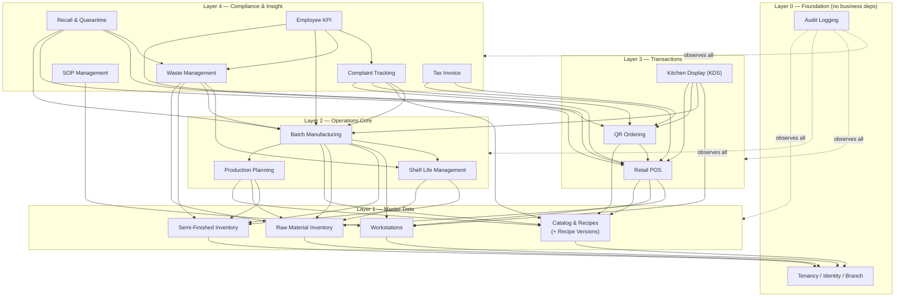
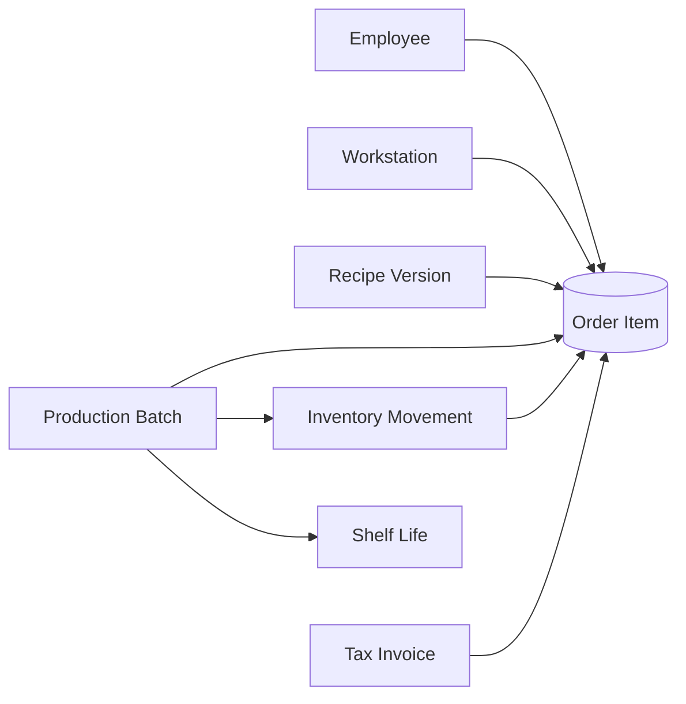

# 07 — Module Dependency Map

> Part of the [MR.BANANA'S OS architecture set](./00-README.md). Status: **Draft for approval.**

The 13 business modules are layered. Lower layers know nothing about higher layers;
dependencies point **downward only**. This is what makes the modular monolith
maintainable and the build order obvious.

---

## 1. Dependency layers



---

## 2. Why each dependency exists

| Module | Depends on | Because |
|--------|-----------|---------|
| Catalog & Recipes | Tenancy | Products/recipes belong to a tenant; versions are tenant-scoped |
| Raw / Semi inventory | Tenancy | Stock is branch-scoped |
| Shelf Life | Raw, Semi (+ produced lots) | Expiry is a property of lots from those sources |
| Production Planning | Catalog, Raw, Semi | Plans target products and check ingredient availability |
| **Batch Manufacturing** | Planning, Catalog, Raw, Semi, Workstation, Shelf Life | **The hub** — produces finished lots, consumes inventory, sets shelf life |
| Retail POS | Catalog, Workstation, Raw | Sells products, captures workstation, depletes ingredients (beverages) |
| QR Ordering | Catalog, POS | Customer-facing front-end onto the same order pipeline |
| KDS | POS, QR, Batch, Workstation | Routes order items (incl. batch-sourced) to stations in realtime |
| Tax Invoice | POS, QR | An invoice is issued from a completed sale |
| Waste | Raw, Semi, Batch, Shelf Life | Waste is logged against lots/batches and expiry |
| SOP | Workstation | Procedures govern stations/tasks |
| Complaint | POS, QR, Catalog, Batch | Complaints trace to orders, products, and batches |
| Recall & Quarantine | Batch, POS, QR, Waste | Traverses batch→lot→order_item to find affected sales; quarantines lots (blocking sale); disposes via waste |
| Employee KPI | POS, Batch, Waste, Complaint | KPIs are computed from operational events |
| Audit | (observes all) | Cross-cutting; written by triggers, depended on by none |

---

## 3. The traceability hub

Note that **Batch Manufacturing** and the **Order/POS** pipeline are the two points
where the most dependencies converge — exactly the six traceability anchors meet
here:



This convergence is intentional: keeping these as in-process module calls (not
network calls) makes the all-important provenance writes **transactional** — they
succeed or fail together.

---

## 4. Rules that keep the map clean

1. **Downward-only dependencies.** No module imports from a higher layer. KDS may
   call POS; POS may never call KDS.
2. **No cycles.** The graph is a DAG. QR→POS is allowed; POS→QR is not.
3. **Import through the front door.** A module imports another only via its
   `index.ts` public interface (see [Folder Structure §3](./03-folder-structure.md)),
   enforced by ESLint boundaries.
4. **Audit depends on nothing.** It is written by database triggers so it can observe
   every module without coupling to any.
5. **Shared kernel, not shared modules.** Cross-cutting helpers (money, time, FEFO)
   live in `lib/`, not inside a business module, to avoid accidental coupling.

---

## 5. Build-order implication

The layering dictates the [roadmap](./08-development-roadmap.md): you cannot build
POS before Catalog, or Batch before Inventory. The critical path is:

```
Tenancy → Catalog & Inventory → Production/Batch → POS/QR/KDS → Tax/Waste/Compliance → KPI
```

Modules within the same layer (e.g. Raw + Semi inventory) can be built in parallel.

---

## 6. Future extraction candidates

If/when load demands a service split, the cleanest seams — modules with few inbound
dependencies and clear interfaces — are:

| Candidate | Why it splits cleanly |
|-----------|----------------------|
| KDS (realtime) | High-frequency realtime; depends on others but little depends on it |
| QR Ordering | Public-facing, independently scalable traffic |
| KPI rollups | Already async/batch; pure consumer of events |

The matrix is designed so these can leave without the core noticing.
