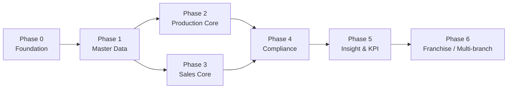

# 08 — Development Roadmap

> Part of the [MR.BANANA'S OS architecture set](./00-README.md). Status: **Draft for approval.**

A **phased, dependency-driven** delivery plan. The order follows the
[Module Dependency Map](./07-module-dependency-map.md): foundations first, then the
operational core, then transactions, then compliance and insight. Each phase ends
with a **shippable, demonstrable** capability — no big-bang launch.

> Durations are **relative effort estimates** for planning, not contractual dates.
> They assume a small focused team. Calibrate after Phase 0.

---

## 1. Phase overview

| Phase | Theme | Rough effort | Milestone |
|-------|-------|-------------|-----------|
| 0 | Foundation & scaffolding | 2–3 wks | Secure skeleton deployable |
| 1 | Master data | 2–3 wks | Catalog, recipes, inventory exist |
| 2 | Production core | 3–4 wks | Bake a traceable batch end-to-end |
| 3 | Sales core (POS/QR/KDS) | 4–5 wks | Sell a traceable beverage end-to-end |
| 4 | Compliance (tax/waste/shelf/SOP/complaints) | 3–4 wks | Compliant, auditable operation |
| 5 | Insight (KPI, dashboards, reporting) | 2–3 wks | Owner can run the business on data |
| 6 | Franchise enablement | 2–3 wks | Onboard a 2nd branch with zero schema change |

---

## 2. Phase 0 — Foundation & scaffolding

**Goal:** a secure, deployable skeleton that proves the architecture's spine.

- Next.js + TypeScript + Tailwind + shadcn/ui project; PWA shell + service worker.
- Supabase project; migration tooling; CI/CD to Vercel (preview + prod).
- **Tenancy schema** (`tenant`, `branch`, `app_user`, `role`, `user_branch_role`,
  `workstation`).
- **Supabase Auth** + custom JWT claims (tenant + branch roles); **short token TTL +
  `session_version` revocation (S1)**; MFA for Owner + Manager.
- **RLS framework**: helper functions + first policies + the audit-log table and
  trigger pattern; **CI guard that fails the build on any RLS-less business table (S2)**.
- App shell: login, branch selection, role-based routing, branch switcher.

**Exit criteria:** A user logs in, lands in the right surface for their role, and RLS
provably blocks cross-branch access (verified by integration test); **revoking a role
invalidates the live session on the next request (S1); the CI RLS guard fails a
deliberately-unprotected test table (S2)**. Audit log captures a mutation. ✅ This phase
de-risks the entire security model first.

---

## 3. Phase 1 — Master data

**Goal:** the data everything else references.

- **`inventory_item` supertype (N1)** + `raw_material`/`semi_finished`/`product`
  subtypes; **`unit_conversion` (UoM, #2)**.
- **Catalog & Recipes**: products, **`branch_product` per-branch price/availability
  (F2)**, recipes, **recipe versions** (immutability + approval), single-FK
  bill-of-materials (N1).
- **Raw Material + Semi-Finished Inventory**: lots with single-source `expires_at`
  (N2), `inventory_movement` append-only ledger as authority + **`qty_on_hand`
  reconciliation job (N3)**, receive flow.
- **Minimal Purchasing (#4)**: `supplier` + `purchase_order` → receive into lots.
- **Anonymous-first customers (#3)**: optional light `customer` profile.

**Exit criteria:** Owner can define a product (with optional per-branch price) and a
versioned recipe; manager receives raw stock via a PO and sees the ledger update with
`qty_on_hand` reconciling; recipe activation is Owner-gated and audited.

---

## 4. Phase 2 — Production core

**Goal:** prove **batch traceability** — Journey B.

- **Production Planning**: daily/weekly plans.
- **Batch Manufacturing**: batches, multi-day `batch_stage` (ferment/proof/bake) with
  **per-stage `employee_id` provenance (B1)**, append-only `batch_event`,
  server-anchored stage timers, **`failed`/`scrapped` states + `actual_yield`-driven
  output (B2)**.
- **Shelf Life**: compute expiry from recipe; FEFO via `ORDER BY expires_at` (N2).
- Inventory consumption (raw/semi) + finished-lot production via movements; scrap → waste.
- **Quarantine flag** on batches/lots (recall foundation; sale-block wired in Phase 3).

**Exit criteria:** A baker runs a multi-day batch across shifts; each stage traces to
**the baker who performed it (B1)**; a failed batch routes scrap to waste (B2);
ingredients deplete, a finished lot is produced with correct shelf life, and the batch
traces to workstation + recipe version + inventory movements. ✅ Half the traceability
spine proven.

---

## 5. Phase 3 — Sales core

**Goal:** prove **made-to-order traceability** — Journey A — and start taking money.

- **Retail POS**: order creation, line items capturing employee/workstation/recipe
  version, **atomic locked stock decrement preventing oversell (I1)**, payments via
  hosted/tokenized gateway (#6, idempotent), offline outbox.
- **QR Ordering**: session via QR, customer order build, realtime status; effective
  price from `branch_product` (F2).
- **KDS**: realtime order routing to beverage/bakery stations; status transitions.
- **Quarantine sale-block**: quarantined lot/batch rejected at the sale transaction.

**Exit criteria:** A beverage is sold via POS and via QR; the order item traces to
all anchors; KDS reflects status in realtime; offline sales replay and reconcile;
**a quarantined lot/batch is rejected at the point of sale** (the recall sale-block
invariant). ✅ Full traceability spine proven for both product types.

---

## 6. Phase 4 — Compliance & quality

**Goal:** make the operation legal, auditable, and quality-controlled.

- **Tax Invoice (Thailand VAT 7%)**: server-issued, **sequential per branch with
  documented gaps** (`invoice_number_gap` records every skipped number), immutable,
  `sale_occurred_at` tax point; credit notes (separate series); Edge Function for Thai
  e-Tax Invoice format.
- **Waste Management**: counter + production-loss logging, costing, approval.
- **SOP Management**: versioned procedures, storage-backed docs, per-workstation
  linkage.
- **Complaint Tracking**: filing, auto-linking to order/batch, assignment, resolution
  workflow.
- **🚩 Recall & Quarantine (LAUNCH-REQUIRED)**: mark any batch/lot `quarantined`
  (blocks sale), traverse the spine to identify affected products/lots/orders, immutable
  recall history, Owner/Manager-initiated, fully audited. *Quarantine flag + sale-block
  can land as early as Phase 2 (batches) and Phase 3 (orders); full affected-order
  tracing completes here. **This must ship before go-live.***

**Exit criteria:** Every sale produces a compliant Thai VAT invoice (gaps documented);
waste is costed; SOPs are accessible at the workstation; a complaint resolves to its exact
batch/recipe/employee; **a recall quarantines a batch, lists every affected order, and
blocks sale of quarantined stock — all immutably audited.**

---

## 7. Phase 5 — Insight & KPI

**Goal:** turn the captured data into decisions.

- **HR & Labor capture**: `shift`, `shift_assignment`, `time_entry` (append-only
  clock-in/out). *(Schema can land earlier alongside Phase 0–1 since it only depends on
  `employee`/`branch`; rollups wait for operational data here.)*
- **Employee KPI**: scheduled rollups (orders/labor-hour, on-time production, waste %,
  complaint rate, attendance/punctuality); per-employee and per-branch dashboards.
- **HR Export**: one-way outbound feed (attendance, shift, KPI, performance) to the
  external HR/payroll system, with `hr_export` audit records. **No payroll calculation
  in scope** — that is the external system's job.
- Owner/Manager dashboards; financial and operational reporting.
- Production forecasting (nightly Edge Function feeding production planning).

**Exit criteria:** Owner sees branch and staff performance; manager plans production
from forecasts; reports reconcile with the immutable ledgers; an attendance/KPI export
is generated and ingestible by the external payroll system.

---

## 8. Phase 6 — Franchise enablement

**Goal:** validate the multi-branch promise with **no schema migration**.

- Branch onboarding flow (Owner).
- Cross-branch reporting & consolidated dashboards.
- Stock transfer between branches (with approval).
- Per-branch tax profiles, menus, SOPs.
- Load/RLS validation with multiple branches; confirm isolation holds.

**Exit criteria:** A second branch is onboarded entirely through configuration; data
isolation is verified; consolidated reporting works. ✅ The day-one multi-tenant
decision pays off.

---

## 9. Cross-cutting workstreams (every phase)

| Workstream | Practice |
|------------|----------|
| **Security** | RLS policy + integration test ships with every table; audit on every sensitive mutation |
| **Testing** | Unit (services), integration (RLS + DB), E2E (Playwright on the phase's headline journey) |
| **Migrations** | Versioned SQL in repo; never hand-edited in dashboard; reviewed in PR |
| **ADRs** | Each significant decision recorded in `/docs/adr/` |
| **Observability** | Structured logs + Supabase/Vercel metrics from Phase 0 |
| **Accessibility & i18n** | Baked into shadcn/ui components; branch-localized formatting |

---

## 10. Top risks & mitigations

| Risk | Impact | Mitigation |
|------|--------|------------|
| RLS gaps leak cross-branch data | Critical | Build RLS in Phase 0; test isolation per table; deny-by-default |
| Offline POS reconciliation conflicts | High | Idempotency keys; server-authoritative resolution; never finalize invoices offline |
| Multi-day batch timing across shifts | Medium | Server-anchored timestamps; per-stage employee provenance (B1); append-only events |
| Concurrent oversell of stock | High | Atomic locked decrement in the sale txn (I1) — Phase 3 |
| Inventory integrity (polymorphic refs, on-hand drift) | High | `inventory_item` supertype single-FK (N1); ledger-authority + reconciliation (N3) |
| Stale session after termination | High | Short token TTL + `session_version` revocation (S1) — Phase 0 |
| New table ships without RLS | Critical | CI guard fails the build (S2) — Phase 0 |
| ~~Tax/e-invoice jurisdiction unknown~~ ✅ resolved (Thailand VAT 7%) | — | Documented-gap numbering; Thai e-Tax Invoice isolated in Edge Function |
| Recall not actionable in a food business | Critical | Recall & Quarantine elevated to launch-required (Phase 4, blocks go-live) |
| ~~Unit-of-measure complexity~~ ✅ resolved | — | `unit_conversion` table |

---

## 11. Pre-build decisions — all resolved ✅

Every schema-blocking decision is now locked:

1. ✅ **Jurisdiction:** Thailand, VAT 7%, sequential-by-branch with documented gaps.
2. ✅ **Unit-of-measure:** `unit_conversion` table.
3. ✅ **Customer accounts:** anonymous-first + optional light profile.
4. ✅ **Suppliers/purchasing:** minimal `supplier` + `purchase_order` now.
5. ✅ **MFA:** required for Owner **and** Manager.
6. ✅ **Payment:** hosted/tokenized gateway (out of PCI scope).

Plus the 8 adversarial-review fixes (N1–N3, I1, B1–B2, F2, S1–S2) — all folded into the
schema/contracts. The only non-blocking item left is beverage **modifiers** (size/milk/
sugar), slated for Phase 1.

---

## 12. Definition of done (per module)

A module is "done" only when: RLS policies + tests pass · audit logging verified ·
the traceability anchors it owns are captured · its public `index.ts` interface is
stable · the phase's E2E journey passes · docs/ADR updated.

> ✅ **All pre-build decisions are locked and the review fixes are folded in.** The design
> is green for Phase 0. No application code is written until the build is authorized.
