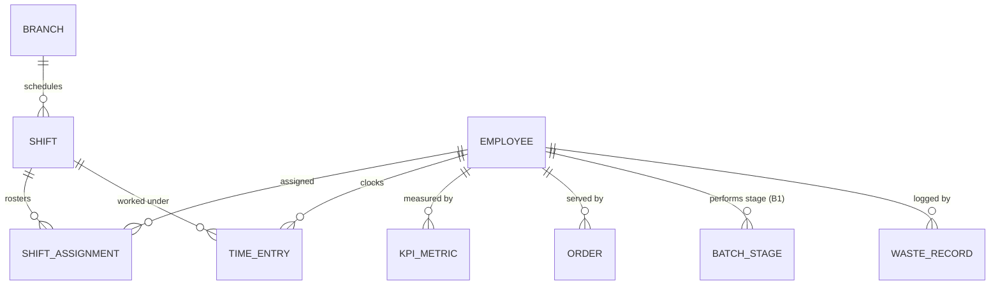
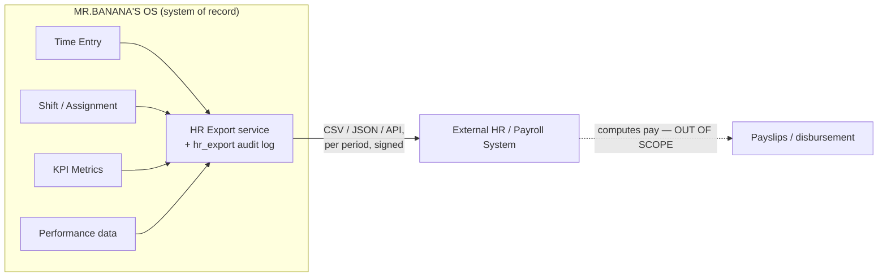

# 09 — Design Considerations & Requirements Traceability

> Part of the [MR.BANANA'S OS architecture set](./00-README.md). Status: **Draft for approval.**

This document maps the **ten critical considerations** to the architecture, so each is
demonstrably handled before any code is written. Eight were already designed into the
set as first-class drivers; one (**HR/KPI**) is **deepened here** with the entities it
was missing.

**Coverage key:** ✅ Fully designed · ➕ Enhanced in this document · ⚠️ Designed, pending a §11 decision

---

## 1. Traceability matrix — the ten concerns

| # | Consideration | Status | Where it lives |
|---|---------------|:------:|----------------|
| 1 | Multi-day bakery production | ✅ | [Arch §5](./01-system-architecture.md), [ER §4 `batch_stage`/`batch_event`](./02-database-er-diagram.md), [Flow Journey B](./04-user-flows.md) |
| 2 | Recipe version control | ✅ | [ER §4 `recipe_version`](./02-database-er-diagram.md), [ER §5 immutability](./02-database-er-diagram.md), [Matrix §recipes](./06-role-permission-matrix.md) |
| 3 | Tax invoice immutability | ✅ | [Security §5](./05-security-model.md), [ER §5](./02-database-er-diagram.md), [Matrix §tax](./06-role-permission-matrix.md) |
| 4 | Employee traceability | ✅ | [Arch §5 spine](./01-system-architecture.md), [ER §3](./02-database-er-diagram.md), ➕ HR layer below |
| 5 | Shelf-life tracking | ✅ | [ER §4 `shelf_life`](./02-database-er-diagram.md), [Flow Journey B](./04-user-flows.md), FEFO in `lib/fefo.ts` |
| 6 | Waste management | ✅ | [ER §4 `waste_record`](./02-database-er-diagram.md), [Matrix §waste](./06-role-permission-matrix.md) |
| 7 | Inventory batch tracking | ✅ | [ER §4 `inventory_lot`/`inventory_movement`](./02-database-er-diagram.md) |
| 8 | Future franchise support | ✅ | [Arch §4](./01-system-architecture.md), [Security §4](./05-security-model.md), [Roadmap Phase 6](./08-development-roadmap.md) |
| 9 | HR / KPI integration | ➕ | [ER §7 KPI](./02-database-er-diagram.md) + **HR model added below** |
| 10 | Security-first architecture | ✅ | [Security Model (whole doc)](./05-security-model.md) |

The sections below state, for each, **the requirement → how the architecture meets it
→ what could still bite us**.

---

## 2. Multi-day bakery production ✅

**Requirement:** fermentation, proofing, baking and semi-finished stages can span
hours or days, across shift changes, without losing state or timing.

**How it's met:**
- `production_batch` → ordered `batch_stage` rows (`mix → ferment → proof → bake →
  cool → pack`), each with `planned_start/end` and `actual_start/end`.
- Timers are **anchored to database timestamps** (server time), not client clocks — a
  closed browser, a shift handover, or a reload recomputes elapsed time correctly.
- Every transition writes an append-only `batch_event` (temperature, checks, notes),
  giving a complete production history.
- Semi-finished outputs (dough, starter) become `inventory_lot` rows of
  `item_kind='semi'`, available as inputs to later stages or other batches.

**Residual risk:** stage SLAs (e.g. "proof must not exceed N hours") — add alerting in
Phase 2 if required. Flagged in [Roadmap §10](./08-development-roadmap.md).

---

## 3. Recipe version control ✅

**Requirement:** recipes change over time; every product must trace to the **exact
formula** used, and changes must be controlled.

**How it's met:**
- `recipe_version` carries `version_no`, `status` (`draft → active → retired`),
  `shelf_life_hours`, `yield_qty`, `effective_from`.
- **Active versions are immutable** — a DB trigger blocks edits; a change creates a
  new version (separation of duties: Manager drafts, **Owner activates** —
  [Matrix](./06-role-permission-matrix.md)).
- Both `order_item.recipe_version_id` and `production_batch.recipe_version_id` pin the
  precise version, so a sale or batch is reproducible years later.

**Residual risk:** none structural. Optional: a recipe-diff/changelog view for
operators (nice-to-have, Phase 5).

---

## 4. Tax invoice immutability ✅ (Thailand)

**Requirement:** legally compliant, tamper-proof invoices.

**How it's met:**
- `tax_invoice` is **insert-only**; numbers are **sequential per branch with documented
  gaps** (per-branch counter + unique `(branch_id, invoice_no)`). Skipped numbers are
  recorded in `invoice_number_gap` — strict gapless is **not** attempted (Thailand VAT 7%;
  see [Review T1/T4](./10-architecture-review.md)).
- No role — not even Owner — can edit or delete an invoice ([Matrix §admin note](./06-role-permission-matrix.md)).
- Corrections are issued as **credit notes** (new immutable records), never edits.
- Invoices are **issued server-side only**, never finalized offline, keeping the
  sequence valid even during POS outages ([Flow §6](./04-user-flows.md)).

**Pending decision:** exact format and e-invoice integration depend on **jurisdiction**
([§11 #1](#11-decisions-still-needed)). Isolated in an Edge Function so the regime can
change without touching the core.

---

## 5. Employee traceability ✅ (➕ extended)

**Requirement:** every product traces to the employee who made/sold it.

**How it's met:**
- The traceability spine pins `employee_id` on both `order_item` (sold) and
  `production_batch` (baked) — [Arch §5](./01-system-architecture.md).
- `employee` is distinct from `app_user`: not every employee logs in, not every login
  is an employee — clean separation for HR vs. auth.
- Combined with `workstation_id`, the system answers "who made this, where, from which
  recipe version and batch" for any item.

➕ The HR layer in §10 below extends this from *who-made-it* to *who-was-on-shift*,
closing the loop for KPI and labor accountability.

---

## 6. Shelf-life tracking ✅

**Requirement:** enforce freshness; rotate stock correctly; prevent selling expired
product.

**How it's met:**
- `expires_at` is computed from the batch's `produced_at` + the recipe version's
  `shelf_life_hours` and **stored once on `inventory_lot`**; `shelf_life` is a *view*
  (N2). Status flows `fresh → expiring → expired`.
- **FEFO** (First-Expired-First-Out) = `ORDER BY expires_at` (indexed), enforced in the
  inventory service (`lib/fefo.ts`) — no stored rank to go stale.
- Expiring/expired lots surface to staff and feed [Waste](#7-waste-management--).

**Residual risk:** clock/timezone correctness — mitigated by UTC `timestamptz`
everywhere with per-branch display ([Arch §8](./01-system-architecture.md)).

---

## 7. Waste management ✅

**Requirement:** capture, categorize and cost all loss; tie it to accountability.

**How it's met:**
- `waste_record` logs `qty`, `reason` (`spoilage`/`expiry`/`production_loss`/`damage`),
  `cost_value`, `employee_id`, optional `lot_id`.
- Two logging paths with separated duties: **counter waste** (Staff) and
  **production-loss** (Baker); **approval/adjustment** is Manager-only
  ([Matrix](./06-role-permission-matrix.md)).
- Waste links to lots/batches/shelf-life, so spoilage roots back to a batch or recipe,
  and flows into KPI (waste %).

---

## 8. Inventory batch tracking ✅

**Requirement:** track stock by lot/batch with full movement history.

**How it's met:**
- `inventory_lot` is the unit of tracking (`item_id` → `inventory_item` supertype,
  optional `batch_id`, `qty_on_hand` cache, `expires_at`). Item kind lives on the
  supertype (N1).
- `inventory_movement` is an **append-only ledger** (`receive`/`consume`/`produce`/
  `sell`/`waste`/`adjust`/`transfer`) — on-hand is reconciled from movements, never
  silently overwritten. Corrections are new `adjust` rows.
- Every movement carries `ref_type`/`ref_id`, linking it to the order item or batch
  that caused it — the inventory half of the traceability spine.

---

## 9. Future franchise support ✅

**Requirement:** scale from one store to many branches without a rewrite.

**How it's met:**
- `tenant_id` + `branch_id` on **every** business table from day one; isolation
  enforced by **RLS**, not application code ([Security §4](./05-security-model.md)).
- A user holds **per-branch roles** (`user_branch_role`) — Manager at one branch,
  Staff at another.
- Branch-scoped tax profiles, menus, SOPs, and sequential per-branch invoice numbering.
- [Roadmap Phase 6](./08-development-roadmap.md) onboards a second branch as
  **configuration, not migration**, and validates isolation under multi-branch load.

---

## 10. HR / KPI integration ➕ (deepened)

**Requirement:** measure employee productivity, quality and attendance — and ground
KPIs in real labor data, not just sales counts.

> **Scope decision (locked 2026-06-19):** MR.BANANA'S OS is the **system of record**
> for HR *operational* data and a **source feed** for an external HR/payroll system.
> It is **NOT responsible for payroll calculation.** It owns: Employee KPI, Attendance,
> Shift Assignment, Time Entry, and **HR Export**. Payroll math, tax withholding, and
> pay disbursement are handled by a separate HR system that consumes our export.

This boundary keeps us out of payroll-compliance scope entirely and makes the
integration a clean one-way data feed.

**Gap closed:** the original model had `kpi_metric` (rollup output) but **no source
attendance/shift data**, so metrics like "orders per labor-hour" or "on-time
attendance" were not computable. This section adds the missing HR entities + the
export contract. They slot cleanly into the existing `employee` and `branch` tables.

### New HR entities

| Table | Key columns | Purpose |
|-------|-------------|---------|
| `shift` | id, branch_id, role_hint, planned_start, planned_end, status | A scheduled work block |
| `shift_assignment` | id, shift_id, employee_id, status | Who is rostered to a shift |
| `time_entry` | id, employee_id, branch_id, shift_id?, clock_in, clock_out, source (`pos`/`kiosk`/`manual`), approved_by? | Actual clock-in/out (append-only; edits via adjustment) |
| `kpi_metric` *(existing)* | id, branch_id, employee_id?, metric_key, period, value, computed_at | Rolled-up result |
| `hr_export` | id, tenant_id, branch_id?, export_type (`attendance`/`shift`/`kpi`/`performance`), period_start, period_end, format (`csv`/`json`/`api`), status, payload_ref (Storage), generated_by, generated_at | **Audit record of every export** to the external HR/payroll system |

### KPIs now computable (scheduled Edge Function rollup)

| Metric | Source data | Dimension |
|--------|-------------|-----------|
| Orders / labor-hour | `order` + `time_entry` | employee, branch |
| Sales value / labor-hour | `order` + `time_entry` | employee, branch |
| On-time production rate | `batch_stage` planned vs actual | baker, branch |
| Waste % (by cost) | `waste_record` ÷ production cost | employee, branch |
| Complaint rate | `complaint` ÷ orders served | employee, branch |
| Attendance / punctuality | `shift_assignment` vs `time_entry` | employee, branch |

### HR Export — the boundary to the external payroll system

A one-way outbound data feed. MR.BANANA'S OS generates the export; the external HR/
payroll system consumes it and performs all pay calculation.

| Export | Contents | Typical period |
|--------|----------|----------------|
| **Attendance** | clock-in/out, hours worked, late/absent flags (from `time_entry` vs `shift`) | Pay period |
| **Shift** | rostered shifts & assignments | Pay period |
| **KPI** | per-employee productivity/quality metrics | Pay period / monthly |
| **Performance** | composite performance summary (KPI + complaint + waste signals) | Monthly |

- Every export is recorded in **`hr_export`** (what, which period, by whom, when, and
  the stored payload) — so the feed is itself auditable and re-runnable.
- Exports are **derived, read-only snapshots** — generating one never mutates source
  data.
- Delivery options (decide at build): scheduled file drop to Supabase Storage with
  signed URL, or a pull API for the external system. Format is configurable
  (CSV/JSON) per the payroll vendor's spec.
- **Explicitly out of scope:** pay rates, gross/net calculation, tax/withholding,
  disbursement. We never store salary or bank details.

### Privacy & access
- HR data (`time_entry`, `shift`) is PII — RLS-scoped to branch; visible to
  Owner (all) and Manager (own branch). Staff/Baker see **own** metrics only
  ([Matrix §KPI](./06-role-permission-matrix.md)).
- `time_entry` is append-only; corrections are approved adjustments, audited like
  every other ledger.
- Export generation is **Owner/Manager-only** and every run is audited via
  `hr_export` + the standard `audit_log`.

**Decision: RESOLVED (2026-06-19)** — HR scope is KPI + Attendance + Shift +
Time Entry + Export. Payroll calculation is external and out of scope.

> **Action:** these three tables should be folded into [ER §3 (Tenancy & Identity)](./02-database-er-diagram.md)
> and a new HR migration (`0009_hr.sql`) added to [Phase 5](./08-development-roadmap.md)
> on approval.

---

## 11. Security-first architecture ✅

**Requirement:** security, audit logging and RBAC are mandatory, not bolted on.

**How it's met (summary — full detail in [Security Model](./05-security-model.md)):**
- **Seven-layer defense in depth**; the **database (RLS) is the final authority**, not
  the app.
- RBAC realized as RLS policies keyed on tenant + branch + role; **deny-by-default**.
- **Append-only audit log** written by DB triggers on every sensitive mutation —
  un-skippable, un-editable.
- Immutable ledgers (inventory, production, invoices, audit) and MFA for elevated
  roles.
- Built **first** ([Roadmap Phase 0](./08-development-roadmap.md)) so every later table
  ships with its policy and test — security is the foundation, not a phase.

---

## 12. Net changes this review introduces

| Change | Effect |
|--------|--------|
| ➕ Add `shift`, `shift_assignment`, `time_entry`, `hr_export` | Makes HR/KPI metrics computable and exportable from real labor data |
| ➕ New migration `0009_hr.sql` in Phase 5 | Sequenced after KPI groundwork |
| ➕ HR Export service (one-way feed + audit) | Clean boundary to external HR/payroll; no payroll math in-scope |
| ✏️ Cross-reference HR in ER §3 and Matrix §KPI | Keeps the set consistent |
| No change to | Traceability spine, tenancy/RLS, invoice/recipe immutability — all already satisfied |

---

## 13. Decisions — all resolved ✅

1. ✅ **Jurisdiction / tax:** Thailand, VAT **7%**, sequential-by-branch with documented
   gaps (`invoice_number_gap`); no strict gapless. Thai e-Tax Invoice; PDPA for PII.
2. ✅ **Unit-of-measure:** `unit_conversion` table (base unit + conversions).
3. ✅ **Customer accounts:** anonymous-first + optional light `customer` profile.
4. ✅ **Suppliers/purchasing:** minimal `supplier` + `purchase_order` now.
5. ✅ **MFA:** required for Owner **and** Manager.
6. ✅ **Payment:** hosted/tokenized gateway (PCI scope-out).
7. ✅ **HR scope:** KPI + Attendance + Shift + Time Entry + Export; **no payroll**.

**Remaining non-blocking sub-details (confirm at build, not schema-blocking):** HR export
delivery (file drop vs. pull API) & payroll-vendor format; beverage modifier shape
(size/milk/sugar).

> ✅ All ten considerations are accounted for; HR scope is now locked. The structural
> additions are the four HR tables + the export feed in §10. Awaiting approval before
> any code is written.
