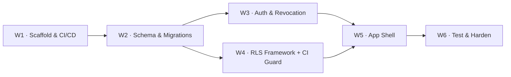

# 11 — Phase 0 Implementation Plan

> Part of the [MR.BANANA'S OS architecture set](./00-README.md). Status: **Plan — awaiting build authorization. No application code written yet.**

Phase 0 is the **foundation & security-de-risking** phase. It builds nothing
customer-facing. Its sole job is to prove — with running, tested infrastructure — that the
hardest, most load-bearing decisions in the architecture actually hold:

- **RLS isolates tenants/branches** at the database, not the app.
- **JWT revocation (S1)** kills a stale session immediately.
- **The CI RLS guard (S2)** fails the build the moment a table ships unprotected.
- **The audit log** captures every sensitive mutation, immutably.
- **The inventory-item supertype (N1)** and append-only ledger patterns are established
  before any module depends on them.

If Phase 0 passes, every later phase inherits a secure, traceable substrate. If it fails,
we learn it now — before a single business module is built on sand.

---

## 1. Scope

### In scope (Phase 0)
| Area | Deliverable |
|------|-------------|
| Project scaffold | Next.js (App Router) + TypeScript + Tailwind + shadcn/ui; PWA shell + service worker registration |
| Data plane | Supabase project; migration tooling; **tenancy + identity schema**; audit-log table + trigger pattern; **`inventory_item` supertype stub** |
| Auth | Supabase Auth; custom JWT claims (tenant + branch roles); **short TTL + `session_version` revocation (S1)**; MFA enforced for Owner + Manager |
| Authorization | RLS helper functions; deny-by-default baseline; first policies on tenancy tables; **CI guard failing build on any RLS-less business table (S2)** |
| App shell | Login → branch selection → role-based routing → branch switcher |
| CI/CD | Vercel (preview + prod) + Supabase migration pipeline; test runners wired |
| Testing | RLS isolation tests, revocation test, CI-guard self-test, audit-capture test |

### Explicitly OUT of scope (Phase 0)
POS, QR, KDS, production, inventory movements, recipes, tax invoices, recall, HR, KPI —
**all business modules.** Phase 0 ships **no sellable feature**; it ships a *secure
skeleton*. The full `inventory_item`/lot/movement model lands in Phase 1; here we only
create the supertype table + pattern so the convention is set.

---

## 2. Workstream breakdown



### W1 — Project scaffold & CI/CD
- Initialize repo, Next.js App Router, TypeScript strict, Tailwind, shadcn/ui.
- PWA: `manifest.ts`, service worker registration (no offline outbox yet — that's Phase 3).
- Vercel project (preview-per-PR + prod); Supabase local (Docker) for dev.
- Migration tooling + `supabase/migrations/` convention; CI runs migrations against an
  ephemeral DB on every PR.
- ESLint with the **module-boundary rule** and a **server-only import boundary** (so the
  service-role key can never reach a client bundle — S3 groundwork).

### W2 — Schema & migrations (Phase 0 tables only)
Migration files, in order:

| Migration | Contents |
|-----------|----------|
| `0001_core_tenancy.sql` | `tenant`, `branch`, `app_user`, `role`, `user_branch_role`, `workstation` |
| `0002_identity_support.sql` | `employee` (distinct from `app_user`), `session_version` per user |
| `0003_inventory_item_supertype.sql` | `inventory_item` supertype table + pattern docs (N1 convention established) |
| `0004_audit.sql` | `audit_log` (append-only) + the reusable trigger function |
| `0007_rls_policies.sql` | RLS helper functions + deny-by-default + tenancy policies |
| `0008_audit_triggers.sql` | Attach audit triggers to tenancy tables |

> Numbering leaves gaps (`0005/0006`) reserved for Phase 1 catalog/inventory so files stay
> in logical domain order. RLS + audit live in their own dedicated, reviewable migrations.

### W3 — Auth & revocation (S1)
- Supabase Auth email/password; MFA **required** for Owner + Manager.
- Auth hook stamps JWT claims: `tenant_id`, `branch_roles[]`, and `session_version`.
- **Revocation mechanism:** a per-user `session_version` integer. Each request validates the
  JWT's `session_version` against the current DB value (cheap, cached). Role change /
  termination **bumps `session_version` and revokes refresh tokens** → the next request from
  any stale token fails fast.
- Access-token TTL set short (≤ 5–15 min); refresh rotation enabled.
- Cookies: HttpOnly, Secure, SameSite; no JWT in localStorage.

### W4 — RLS framework + CI guard (S2)
- Helper functions: `auth.tenant_id()`, `auth.branch_ids()`, `auth.has_branch_role(...)`,
  all `STABLE`, `SECURITY DEFINER` with a pinned `search_path`.
- **Deny-by-default**: a baseline confirming every business table has RLS enabled with ≥ 1
  policy.
- First real policies on tenancy tables (read = branch in claims; write = sufficient role).
- **CI guard:** a test that queries `pg_tables`/`pg_policies` and **fails the build** if any
  table in the business schema lacks `rowsecurity = true` or has zero policies. Ships with a
  deliberately-unprotected fixture table to prove the guard actually fails red.

### W5 — App shell
- `(auth)/login`, branch-selection screen, role-based routing into the (empty) surface
  layouts for each role, branch switcher.
- Middleware resolves session → tenant + branch + role context and injects it; rejects
  unauthenticated requests.
- Surfaces are stubs — they prove routing/authz, not features.

### W6 — Test & harden
- See §4. This is where Phase 0 earns its exit criteria.

---

## 3. Key design artifacts produced in Phase 0

1. **The RLS policy template** every future table copies (read/write split on tenant +
   branch + role).
2. **The append-only audit trigger** every sensitive table will attach.
3. **The migration + review convention** (RLS/audit in dedicated files, gapless-in-logical-
   order numbering).
4. **The revocation pattern** (`session_version`) used by all auth going forward.
5. **The first ADRs** in `/docs/adr/` graduating the architecturally-significant decisions
   (AD-1…AD-7 plus the 12 review resolutions).

---

## 4. Testing & exit criteria

Phase 0 is **done** only when all of these pass in CI:

| # | Test | Proves |
|---|------|--------|
| T1 | Cross-branch read denied | A user with Branch A claims cannot read Branch B rows (RLS isolation) |
| T2 | Cross-tenant read denied | Franchise isolation holds at the DB |
| T3 | Write authz | Staff cannot perform an Owner-only write; RLS `WITH CHECK` enforces role |
| T4 | **Revocation (S1)** | After `session_version` bump, a previously-valid token's next request fails |
| T5 | **CI RLS guard (S2)** | The guard fails red against a deliberately-unprotected fixture table, green otherwise |
| T6 | Audit capture | A mutation on a tenancy table writes an immutable `audit_log` row with before/after |
| T7 | Service-role boundary (S3) | Build/bundle check confirms the service-role key is absent from any client-reachable bundle |
| T8 | Routing/authz | Each role lands on its correct surface; unauthenticated is rejected |

**Exit gate:** T1–T8 green in CI on the prod-config preview, plus the five design artifacts
(§3) committed. Only then does Phase 1 begin.

---

## 5. Indicative sequencing

Relative effort, small focused team (calibrate after W1):

```
Week 1   W1 scaffold + CI/CD        ┃ W2 tenancy migrations start
Week 2   W2 finish · W3 auth+revoke ┃ W4 RLS framework start
Week 3   W4 finish + CI guard       ┃ W5 app shell
Week 4   W6 test & harden           ┃ exit gate
```

≈ 2–3 weeks as estimated in the [Roadmap](./08-development-roadmap.md), with W3/W4 the
critical path (they de-risk the security model).

---

## 6. Risks specific to Phase 0

| Risk | Mitigation |
|------|------------|
| RLS helper functions slow or mis-scoped | Benchmark early; `STABLE` + pinned `search_path`; test with multi-branch fixtures |
| `session_version` check adds latency per request | Cache current version (short TTL) keyed by user; invalidate on bump |
| CI guard false-greens (misses a table) | Self-test with an unprotected fixture that **must** turn the build red |
| Supabase Auth hook limitations for custom claims | Validate the claim-stamping approach in W1 spike before building on it |
| Over-building (creeping in Phase 1 tables) | Hard scope: only the §2 migration list; everything else is Phase 1 |

---

## 7. Definition of done (Phase 0)

Per the [Roadmap §12](./08-development-roadmap.md) module DoD, adapted for foundation:

✅ All Phase 0 migrations applied cleanly forward (and reversible where applicable) ·
✅ T1–T8 green in CI · ✅ RLS + audit conventions documented and templated ·
✅ Revocation + CI-guard proven by their own adversarial tests · ✅ ADRs committed ·
✅ App shell deploys to a Vercel preview with working role-based routing.

---

## 8. Handoff to Phase 1

On Phase 0 exit, Phase 1 (master data) starts on a substrate where: every new table just
copies the RLS template and gets caught by the CI guard if it forgets; every sensitive
mutation auto-audits; the `inventory_item` supertype is ready for `raw_material` /
`semi_finished` / `product` subtypes; and auth/revocation is a solved problem. The team
builds features, not foundations.

> **No application code is written until build is authorized.** This plan defines *what*
> Phase 0 builds and *how we'll know it worked* — not the implementation itself.
